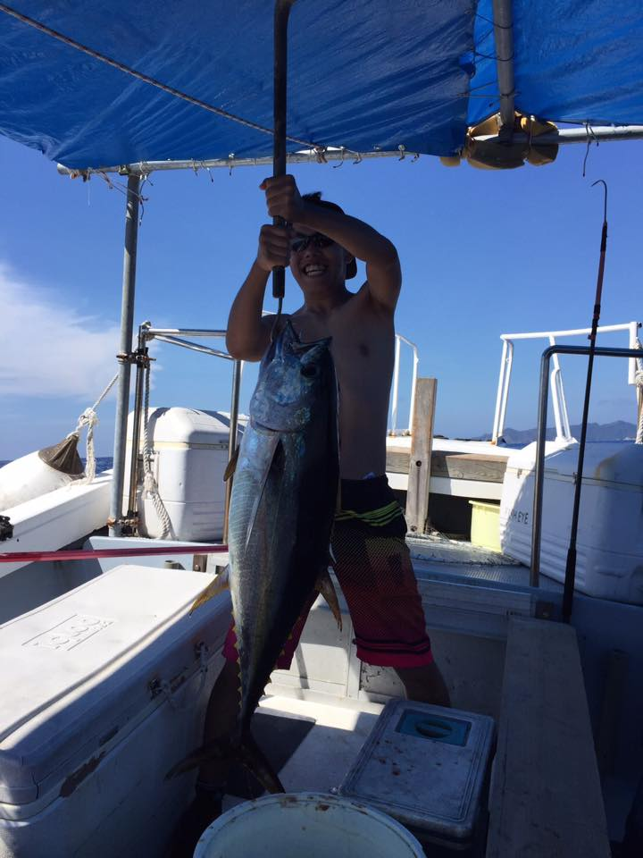

# portfolio
新真虎の自己紹介用リポジトリ

| key | value |
| :--- | :----|
| Name | 新真虎 |
| Status | 大学生 |
| Email | t17023ma@sfc.keio.ac.jp |
| GitHub | https://github.com/MasatoraAtarashi |
| Qiita | https://qiita.com/MasatoraAtarashi |
| AtCoder | https://atcoder.jp/users/masatora |
| Twitter(個人) | https://twitter.com/toramasaA03 |
| Twitter(思いついたアイデアをひたすらツイートするアカウント) | https://twitter.com/Idea_note123 |

# 大学
- 慶應義塾大学環境情報学部

# インターン
### 株式会社ビザスク
| key | value |
| :--- | :----|
| Term | 2019/4 - 2019/6 |
| Job | リサーチアシスタント |

### 株式会社マネーフォワード
| key | value |
| :--- | :----|
| Term | 2019/5 - 現在 |
| Job | エンジニア |
| Detail | MoneyForward MEの開発(Rails) |

### 株式会社サイバーエージェント
| key | value |
| :--- | :----|
| Term | 2019/6 - 2019/6(2日間) |
| Job | エンジニア |
| Detail | バックエンドチューニングコンペティション(Go) |

# 公開中のサービス
| key | value |
| :--- | :----|
| Name | Shiori web for Safari |
| SiteURL | https://apps.apple.com/jp/app/shiori-web-for-safari/id1480539987?l=ja |
| Term | 2019/9 - 2019/9(一週間) |
| Detail | Webにしおりをはさめるアプリ。日本appstore1位を複数回獲得(ニュースカテゴリ) |

| key | value |
| :--- | :----|
| Name | Ten-books |
| SiteURL | https://ten-books.herokuapp.com/ |
| Term | 2019/8 - 2019/8(一週間) |
| Detail | いろんな人の人生を変えた10冊を共有・参照できるアプリ |

# 資格等
- TOEIC820点
- itパスポート
- 情報セキュリティマネジメント
- varsant40点
- 中国語検定準4級

# 趣味
- 釣り(マグロ・シーバス・バス・トラウト・餌釣り・船釣り等フルスタックアングラー)
- 野球
- 読書
- ゲーム

#### 小笠原諸島でマグロを釣ったときの写真
